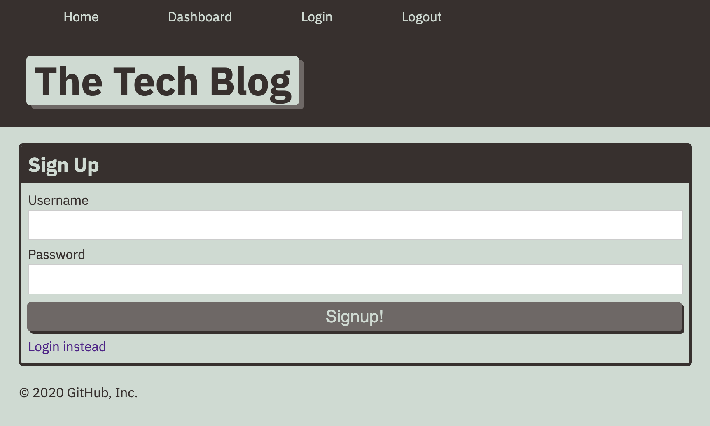

**Tech Blogs**

  ## **Description**
  * This is a back end application for an e-commerce website that uses the latest technologies that allows the company to compete with other e-commerce           comapnies. 
   
  ## **Table of Contents**
  ### [Installation](#Installation)
  ### [Usage](#Usage) 
  ### [Contributing](#contributing)
    
  ## Installation
  * npm i --y
  
  
  ## Usage
 
 https://immense-brushlands-12474.herokuapp.com/

  ## **License:**
  This project is protected under the MIT license.

  ## Contributing
  * express-handlebars
  * mysql2
  * sequelize
  * dotenv
  * bcrypt packages
  * express-session
  * connect-session-sequelize
  
  ## **Questions**
  * Visit me at [gitHub](http://www.github.com/ryannekillian)
  * For additional questions, please reach me at: ryanne.killian@gmail.com
